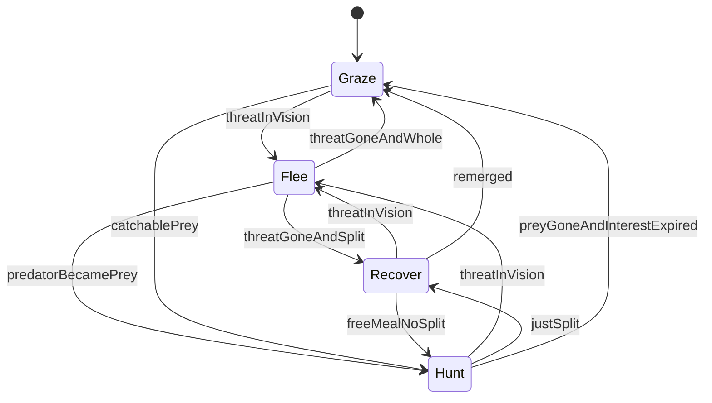

# Bot logic

Decision-loop spec for Phase 6. The bots are ordinary WebSocket clients speaking `join` / `input` / `split`. This file is the brain; the socket client lives in [`bots/`](../bots/README.md). Do not implement the source plan’s “nearest edible, flee if a larger player is closer” loop — it deadlocks, never catches a competent player, and suicide-splits. `input_toward_nearest_food` in [`server/demo.py`](../server/demo.py) is the graze *seed*, not the product.

Numbers taken from [`server/config.py`](../server/config.py) are **hard constraints**. Named feel parameters (small caps in this doc) are retuned after playing.

---

## Hard constraints

Do not retune these in the bot. Cite the live constants, not remembered feel-pass prose.

- **Eat is per piece.** `A.mass > B.mass * EAT_RATIO` (`1.25`) **and** `EAT_OVERLAP` (`0.5`). Never player-total vs player-total. A 400-mass player split into 50s is food to a 70; a 70 split into 35s is food to a 50.
- **A predator at the eat ratio is always slower than its prey.** `speed_for_mass` uses `SPEED_FALLOFF = 0.7`, so at `1.25×` the predator moves at `(1/1.25)**0.7 ≈ 85%` of prey speed. Open-field chasing never works. Corner it or split into it (feel-pass A4; Phase 4 checklist).
- **After a one-piece split, the fragment is edible only if `M/2 > 1.25 * prey`.** Parent must be `> 2.5×` the prey piece. A 1.3× “smaller blob” is not a split target.
- **Exponential split, one shared `last_input`.** `try_split` halves every eligible piece in one press. **Only the new piece is kicked;** the parent stays at half mass with its kick cleared. Kick displacement is `min(SPLIT_KICK_RADII * radius_for_mass(parent), split_kick_displacement_max())`, plus simultaneous steering at `speed_for_mass(half)`. Call `split_kick_speed(parent_mass)`, not a constant. The cap is `min(WORLD_WIDTH, WORLD_HEIGHT) * SPLIT_KICK_MAX_ARENA_FRACTION`. Then `REMERGE_SECONDS` (`10`) of vulnerability: eat is per-piece, so two 100s can be eaten by anyone over 125.
- **`protected` is not prey.** Spawn invulnerability is on the player, not the piece. Splitting during the window neither forfeits nor extends it. A protected player still eats normally.
- **No velocity on the wire.** [`serialize_state`](../server/protocol.py) sends `id`, `name`, `color`, `protected`, `inert`, `peak_mass`, and `pieces[{piece_id, x, y, mass, remerge_in}]`. Closing speed is inferred from the last two `state` snapshots. Food is a separate held field, same as [`client/game.js`](../client/game.js): keep the latest `food` message and splice it onto the view.
- **No pathfinding.** Source plan §7. Corner/wall avoidance is a steering bias, not A*.
- **Near-equals are peers.** If `1/EAT_RATIO ≤ mass_ratio ≤ EAT_RATIO`, the pair is solid: neither food nor threat. A peer ram is a shove, not a kill.

---

## Perception

The server broadcasts the full world. Using that omniscience makes bots psychic. They pretend they cannot.

**Vision** is a circle around the mass-weighted centroid, sized like the follow-cam in [`client/render.js`](../client/render.js): `baseSpan = 420` at `INITIAL_PLAYER_MASS`, scaling with `sqrt(mass / 50)`. Starting **radius** is half that span (~210 at spawn), times personality `vision_scale`. A small hysteresis band (`VISION_EDGE_HYSTERESIS`) so entities do not flicker at the rim.

Vision culls **other players** for classification. New Hunt commits never use off-screen prey. Hunt may keep a short **last-known prey point** after they leave the circle (`HUNT_MEMORY_SECONDS`); Flee keeps a **last-known threat point** (`FLEE_MEMORY_SECONDS`). Neither ghost may refresh from an off-screen piece. Food is not fog-of-war — Graze sees pellets like the browser holding the latest `food` message.

**Graze** picks the nearest pellet in the bot’s 100×100 cell and its 8 neighbors (a 3×3), with target hysteresis. Empty 3×3 → wander (wall-aware), never sit at `(0,0)` while a local pellet exists. The 100×100 grid is a **client-side targeting** index, rebuilt once per process when the food version changes. It is not the server eat scan.

Entities outside vision do not exist for a *new* Hunt commit. After a chase starts, Hunt may keep steering toward the last-seen point until interest expires. Flee uses the same radius for *seeing* a threat — a giant across the map is not a threat — then may keep steering away from the last-seen point.

---

## Classification

Recompute every decision from the vision-culled view. Key off **pieces**, not player totals.

For each foreign piece:

- **Prey** if `our_best_piece.mass > piece.mass * EAT_RATIO` and the owner is not `protected`. An **inert** corpse is prey under the same mass rule even if it is huge — it cannot eat.
- **Threat** if `piece.mass > our_weakest_piece.mass * EAT_RATIO` and the owner is not inert.
- **Peer** otherwise.

`inert` rides `state` next to `protected`. Spawn-protected is not prey; inert is never a threat. A catchable inert piece is a **free meal**: Hunt it on sight (no closing-speed or remelt wait — a corpse does not flee or fuse) and prefer it over Graze pellets. Do not split-lunge into it.

A threat or prey is **approaching** if inferred radial speed toward us exceeds `APPROACHING_SPEED` (feel parameter). Flee from approaching threats, not from every larger disc that happens to be on screen and receding — except during spawn invulnerability, and except when we are already inside the threat’s disc. Panic radius is `FLEE_PANIC_RADII * radius(our mass) + flee_padding + radius(threat)` so a giant covering us is panic even if they are not closing.

---

## State machine

Four states. Priority, highest wins: **Flee > Recover > Hunt > Graze**.



Hysteresis on every transition: a minimum dwell (`STATE_DWELL_SECONDS`) or a score gap, so Hunt/Flee/Graze cannot chatter every tick. Phase 6’s human check is “don’t deadlock, don’t spin in place.”

### Flee

Approaching threat, or any threat inside a tighter panic radius (`FLEE_PANIC_RADII` times our radius, plus personality `flee_padding`, plus the threat’s radius). During `SPAWN_INVULN_SECONDS`, any threat in vision is a Flee trigger — the window is for getting clear, including when the shield is about to drop. Steer toward open space: away from the threat **plus** away from walls and corners. Never flee into a corner. Overlapping a body is not a reason to emit `(0, 0)`; pick an open direction.

No speed-splits at range — they feed the predator. One exception, still inside Flee: **sacrifice split** when whole-body death is imminent. Sacrifice is forbidden while `protected` (we cannot be eaten; splitting makes the life more edible when the window ends). See [Tactics](#tactics-that-are-not-new-states).

### Recover

`len(pieces) > 1` and `max(remerge_in) > 0`, and Flee is not active. Keep the cluster together (same input toward the centroid, or food that does not scatter the pieces). Split is forbidden unless a **free meal**: a prey piece already catchable by a *current* fragment without splitting. Exit to Graze when the cluster is one piece or every `remerge_in` is 0.

### Hunt

A catchable prey in vision, and not Flee/Recover (unless that free meal). Prey always runs — do not wait for a lazy meal. Catchable means one of:

- **Inert** we can eat. Always. Hunt-range and sibling remelt do not apply — the disc does not run, and fragments never fuse back into a threat. Prefer this over live prey and over Graze.
- Any live unprotected prey **in vision** (within personality `hunt_range`), including receding prey. Walk this down; do not split until the kick itself can cover the gap.
- Prey is **trapped** (a wall or corner between them and us).
- **Split-lunge** passes the [checklist](#split-lunge-checklist) below. Chase until the kick reaches, then one `input` aimed from the hitting piece at the prey and `split`. Not used on inert.
- **Punish:** a player who was a threat is now split into pieces we can eat, `remerge_in` above `PUNISH_REMERGE_FLOOR`, and no remaining threatening piece is on a collision course. This is the Flee → Hunt flip, not a fifth state. See [Tactics](#tactics-that-are-not-new-states).

**Targeting** among catchable pieces, eat still per-piece (`our_best > piece.mass * EAT_RATIO`):

1. Inert we can eat — largest mass, then nearer.
2. **Easy kill:** another player with 2+ pieces in vision, every visible piece is prey (no mixed cluster), remelt above `PUNISH_REMERGE_FLOOR`. More fragments beat fewer; then the largest still-edible fragment. Nearest only as a tiebreak.
3. Otherwise the catchable piece with the most mass. Distance is only a tiebreak.

When the live target leaves vision, keep Hunt and steer toward the last-known point for `HUNT_MEMORY_SECONDS`. Do not refresh that point from an off-screen piece, and do not split-lunge at a ghost. If a different edible appears, switch using the ranking above and refresh interest. Flee interrupts immediately and **clears** hunt interest — after the threat is gone, Hunt only resumes if prey is actually in vision again.

When prey is gone **and** interest has expired, exit to Graze (or Recover if the cluster is still split). Open-field chase of a competent fleer still will not catch without a corner or a lunge; the commit is the aggressive read. Protected others are not prey; steer off a shield we could eat rather than graze or hunt onto it.

### Graze

Default. Greedy nearest pellet in the bot’s 100×100 cell **plus 8 neighbors**, with target hysteresis so the input does not flicker. Empty 3×3 → wander. Never sit at `(0, 0)` unless there is genuinely nowhere to go — overlapping a camper or a protected meal is not that case; pick an open direction. `input_toward_nearest_food` is the wrong graze — 1800 pellets and thirty bots all converge and orbit.

During `SPAWN_INVULN_SECONDS`, threats in vision are Flee, not Graze. Get clear of anyone else sitting on the spawn. A spawn-size split (`50 → 25`) is below `MIN_SPLIT_MASS` on the halves and cannot eat anything a fresh life would hunt; do not open with a lunge.

---

## Tactics that are not new states

Two advanced agar.io reads. Neither needs a fifth state. Both are narrower in this physics than in the original game.

### 1. Split while fleeing, for speed — do not do this at range

A competent human almost never splits “to go faster” while already escaping. We are already faster than a predator who can eat us. Splitting makes fragments faster still, but `try_split` only kicks the *new* piece; the parent stays on the old spot at half mass, now *more* edible. The predator eats that parent for free, grows, and the remaining fragment is in more danger, not less.

The one situation that justifies a split inside Flee is **imminent whole-body death**: a threat is at (or will reach this tick) `EAT_OVERLAP` on our only piece, and we would be fully eaten. Eject a fragment along the flee vector. The parent dies; the child might leave engulfment range on the kick. That is a last-resort **sacrifice**, not a speed boost.

Sacrifice checklist (all must pass):

- We are not `protected`.
- We have exactly one piece (or every extra piece is already a lost cause).
- That piece is `>= MIN_SPLIT_MASS`.
- The threat can eat the current whole (`threat.mass > our.mass * EAT_RATIO`) and engulfment / closing time says we die this second if we stay whole.
- Kick direction is into open space, not a wall.

If that fails, keep fleeing unsplit. Personality `split_willingness` may disable sacrifice entirely for timid bots.

### 2. Turn around and punish a split predator — yes, when they become real prey

This one *is* likely, and it is how a hunt-split backfires. A predator who is not quite `2.5×` and splits to catch us drops each fragment to or below the eat ratio. Concrete bands, us at mass `M`. Eat is strict (`a.mass > b.mass * EAT_RATIO`), so the cutoffs are exclusive of equality:

- Predator `P > 2.5M` who splits: fragments still eat us (`P/2 > 1.25M`). **Keep fleeing.**
- Predator `1.6M ≤ P ≤ 2.5M` who splits: neither side can eat (`M` vs `P/2` is inside the peer band). At `P = 1.6M`, `P/2 = 0.8M` and `M > 1.25 * 0.8M` is `M > M`, which is false — fragments are peers, not prey. Turning around is a shove into a faster incoming disc. **Keep fleeing.**
- Predator `1.25M < P < 1.6M` who splits: `M > 1.25 * (P/2)`, so their fragments are food. **Punish:** exit Flee, enter Hunt, walk into the diving fragment (they are not solid to us).

`1.6` is `1 / 0.625`, from `M > EAT_RATIO * (P/2)`, which is `P < 1.6M`. A literal `P <= 1.6M → punish` would ram a peer — the trap below. Do **not** attack on a “small” ratio below `EAT_RATIO`. The eat rule is a cliff, not a gradient. Barely-above-1.25 is a valid punish (they dive into us and we engulf). Barely-below is a trap. The per-piece classifier (Prey / Threat / Peer) is the implementation, not these band labels; the bands are the explanation.

If *every* piece of that player is now prey, the per-piece classifier already drops Flee (no threats left) and Hunt takes over. Require `remerge_in > PUNISH_REMERGE_FLOOR` (start around a few seconds) so they cannot fuse back into a threat mid-bite. Without that floor this becomes “always chase smaller.”

If the cluster is **mixed** (one fragment still a threat, another edible) — possible with uneven pieces — stay in Flee. Do not add an Opportunistic fifth state for the POC; eating a snack while a core can still swallow you is how bots suicide. Mixed-cluster snacking is deferred.

---

## Split-lunge checklist

The competitive core. One `split` message, aimed by the current `input`. All must pass:

1. At least one piece `>= MIN_SPLIT_MASS`, and not already at `MAX_PIECES`.
2. After the exponential split, **the fragment that will hit the prey** still satisfies `half_mass > prey.mass * EAT_RATIO`.
3. The kick pop must cover the gap: `need <=` kick displacement (`split_kick_speed(parent_mass)` integrated over the decay). Do not split from across vision, and do not count `SPLIT_KICK_DECAY_SECONDS` of walking as extra reach. Chase until that range, then aim `input` from the hitter at the prey. Sacrifice still aims along the flee vector. Not used on inert.
4. **Safety:** no threat in vision that could eat any resulting fragment (`threat.mass > half * EAT_RATIO`). If more than one piece is eligible, *every* half must pass, or only split when a single piece is eligible (compact body).
5. Prey is not `protected`.
6. Not already in Recover unless this is a free meal that does not need a further split.

Fail any line → do not split; stay in Graze, or intercept-without-split if that case applies.

---

## Personality

Same state machine for every bot. Vary so a table of 3–5 is not a clone army:

| Knob | Effect |
|---|---|
| `vision_scale` | Multiplier on vision radius |
| `hunt_range` | How far inside vision a prey is worth committing to |
| `split_willingness` | Enables sacrifice / split-lunge; timid bots graze and flee only |
| `flee_padding` | Extra panic radius around threats |

Names and colors stay ordinary `join` fields. `protocol.unique_name` will suffix collisions.

---

## `decide()` contract

Pure function, no sockets, no `time.monotonic()`:

```text
decide(view, memory) -> (dx, dy, split)
```

- `view` is vision-culled players + held food + inferred velocities from the last two snapshots, plus our `welcome` id.
- `memory` is dwell timers, last-known threat/prey ghosts, the current graze waypoint, and the current state. Not wall-clock.
- `dx, dy` are a finite steering vector, same shape as a human `input` message. `(0, 0)` only when there is genuinely nothing to steer toward — not when overlapping a camper or threat.
- `split` is a boolean; the plumbing sends `{"type": "split"}` at most once per rising edge, same as the client ignoring key repeat.

Unit-test the classifier, the four transitions, the split-lunge checklist, the sacrifice checklist, and the punish bands without a server. `input_toward_nearest_food` stays in the demo until the bot graduates it; [`tests/test_main.py`](../tests/test_main.py) already says that.

### Runtime (plumbing, not this file’s job)

Short list so the socket half does not invent a second brain:

- Empty piece list means dead. The next `join` is a new life; drop `memory`.
- Do not steer on a snapshot that does not yet contain our `welcome` id.
- Hold the latest `food` message; `state` no longer carries pellets.
- On disconnect: reconnect with backoff, or exit cleanly (Phase 6 exit criterion). The life is gone; rejoining is a respawn at `INITIAL_PLAYER_MASS`.

---

## Out of scope

- Pathfinding, viruses, mass eject (GUIDEBOOK deferred list).
- Mixed-cluster snacking (stay in Flee).
- `simple_bot.py` itself. This file is the spec that file will follow.
